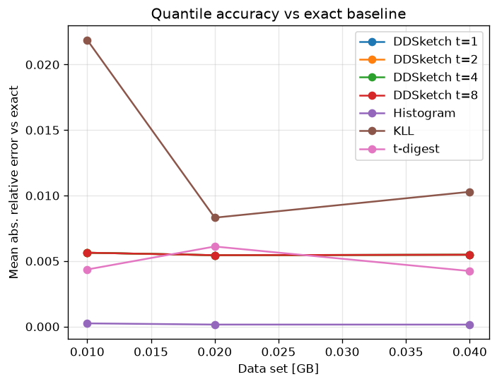
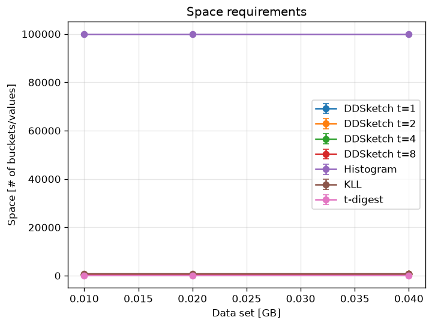
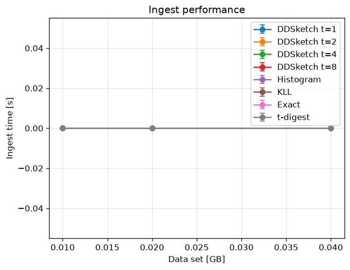
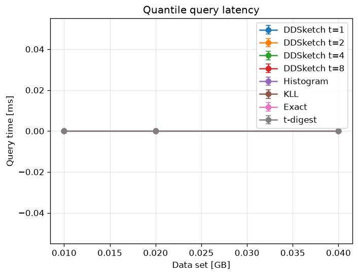

# Data Summaries: Approximate vs. Exact Quantile Computation

Benchmarking study comparing three approaches to computing quantiles over large
datasets:

- **Exact quantiles** — store every value, sort once, index into the sorted
  array. Exact, but `O(n)` memory and dominated by the sort.
- **DDSketch** ([Masson, Rim & Lee, 2019](https://arxiv.org/abs/1908.10693)) — a
  relative-error quantile sketch with bounded memory and a cheap, lossless
  `merge`, which makes it trivially parallelisable across threads/shards.
- **Fixed-width histogram** — a deliberately simple, bounded-memory, mergeable
  baseline whose absolute error is bounded by the bin width.
- **t-digest** ([Dunning & Ertl, 2019](https://arxiv.org/abs/1902.04023)) — a
  merging digest that keeps small centroids at the tails (high tail accuracy)
  and larger ones near the median; tiny, mergeable, and very accurate.
- **KLL** ([Karnin, Lang & Liberty, 2016](https://arxiv.org/abs/1603.05346)) — a
  randomised compactor hierarchy with an optimal `O(1/ε)` rank-error guarantee;
  mergeable and very compact.

The C++ implementation measures ingest, merge, query and space behaviour across
dataset sizes, thread counts, repeated runs and input distributions (uniform,
normal, exponential, lognormal). It can also benchmark a **real dataset loaded
from a file**. The Python tooling parses the logs and renders comparison plots,
including accuracy versus the exact baseline.

## Repository layout

```
project/                     C++17 benchmark
├── main.cpp                 benchmark harness (dataset generation + timing)
├── CMakeLists.txt           build definition (Threads, optional TBB, ctest)
├── ddsketch/                DDSketch implementation
│   ├── ddsketch.{h,cpp}     sketch: add / merge / get_quantile_value
│   ├── dense_store.{h,cpp}  contiguous bucket-count storage
│   ├── logarithmic_mapping.{h,cpp}  value → bucket index mapping
│   └── ddsketch_pycomparison/mytest.py   reference values from the Python lib
├── exact_quantiles/         exact baseline (parallel sort, serial fallback)
├── histogram_sketch/        fixed-width mergeable histogram sketch
├── tdigest/                 merging t-digest
├── kll/                     KLL sketch
├── dataset_generators/      standalone dataset generators
└── tests/                   assertion-based unit tests (run via ctest)

pyplotting/
├── plot.py                  pandas-based plotter (recommended)
└── main.py                  original string-pipeline plotter (legacy)
```

## Building & running (C++)

Requires a C++17 compiler and CMake ≥ 3.20. Intel TBB is used as the backend for
the exact-quantile parallel sort; where it (or `<execution>`) is unavailable the
code falls back to a serial `std::sort`, so the project still builds — e.g. with
plain Apple clang on macOS.

```bash
# optional, enables the parallel sort:
#   Ubuntu/Debian: sudo apt install libtbb-dev
#   macOS (Homebrew): brew install tbb

cmake -S project -B project/build -DCMAKE_BUILD_TYPE=Release
cmake --build project/build

./project/build/Data_Summaries                       # default sweep {0.25, 0.5} GB, 9 runs, uniform
./project/build/Data_Summaries 0.25 0.5 1 2          # dataset sizes (GB)
./project/build/Data_Summaries 0.5 --runs=9 --dist=lognormal   # runs per config + distribution
./project/build/Data_Summaries --file=latencies.txt --runs=5   # benchmark a real dataset
```

CLI flags: positional numbers are dataset sizes in GB; `--runs=N` sets how many
times each configuration is repeated (the plotter averages them); `--dist=` is
one of `uniform` (default), `normal`, `exp`, `lognormal` (a latency-shaped
distribution); `--file=PATH` benchmarks a real dataset (whitespace/comma
separated numbers, optional surrounding `[ ]`) instead of synthetic data. Each
run prints one `key=value` line per algorithm/config
(`alg=dd|sbeq|hist|tdigest|kll`).

## Testing

```bash
cmake -S project -B project/build
cmake --build project/build
ctest --test-dir project/build --output-on-failure
```

The suite checks DDSketch accuracy against the exact baseline, that
multi-partition `merge` equals single-pass ingest, negative-value handling, and
histogram accuracy/merge/out-of-range behaviour.

## Plotting (Python)

```bash
cd pyplotting
python -m venv .venv && source .venv/bin/activate
pip install -r requirements.txt
python plot.py <benchmark_log.txt> --outdir plots
```

`plot.py` parses the log into a DataFrame, averages repeated runs, and writes
error-bar charts for ingest time, query latency, space, and accuracy vs the
exact baseline. (`main.py` is the original, more fragile plotter, kept for
reference.)

## Example results

Generated from a lognormal (latency-shaped) sweep at 0.01 / 0.02 / 0.04 GB,
5 runs per configuration (`Data_Summaries 0.01 0.02 0.04 --runs=5
--dist=lognormal`; raw log in [`docs/example_benchmark_lognormal.txt`](docs/example_benchmark_lognormal.txt)).

| Accuracy vs exact | Space |
| --- | --- |
|  |  |
| **Ingest time** | **Query latency** |
|  |  |

Takeaways: all sketches keep a tiny, data-size-independent footprint (tens to
~10^5 entries) versus the exact baseline's millions; DDSketch ingest scales down
with more threads; t-digest and DDSketch stay within ~0.5–1% relative error,
the fixed-width histogram is most accurate on this positive-valued data, and KLL
trades a little accuracy for a pure rank guarantee.

## CI

`.github/workflows/ci.yml` builds and runs the tests on Linux (with TBB) and
macOS (serial fallback), and runs a Python end-to-end benchmark + plot smoke
test on Linux.
</content>
